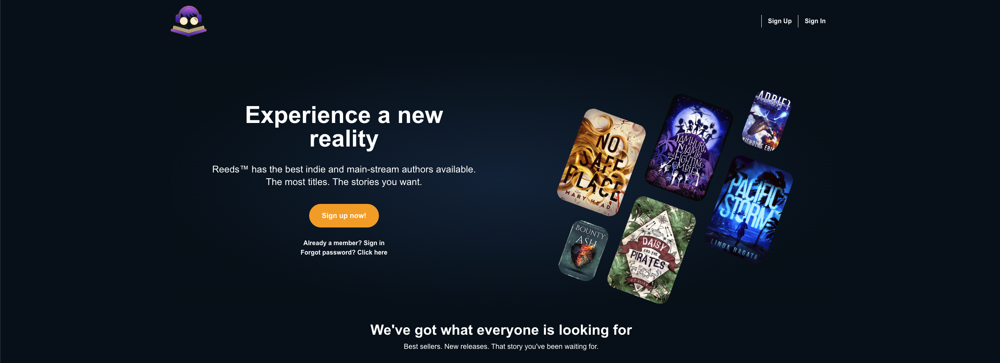
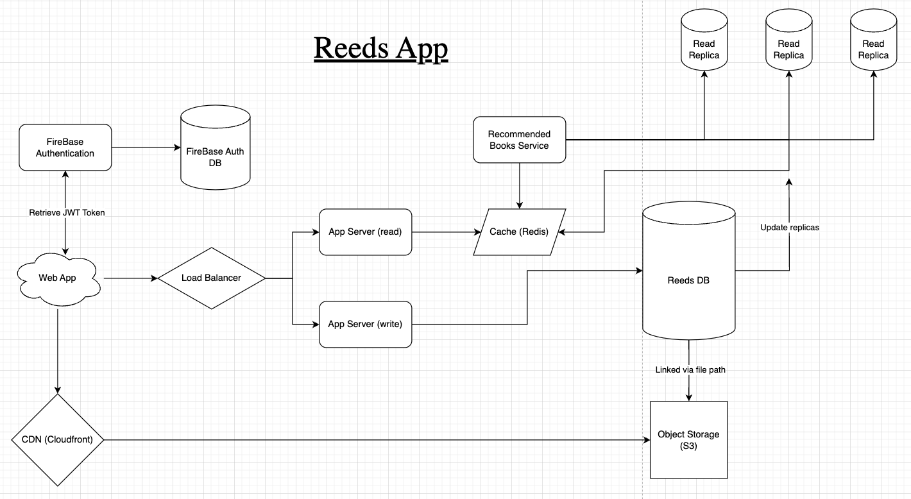

<h1 align="center">
Reeds (a MERN stack app)
</h1> 

<p align="center">
  <a href="https://daltonkirkpatrick.com/" target="_blank" rel="noreferrer"></a>
</p>

<h3 align="center">
Hi there, I'm <a href="https://daltonkirkpatrick.com/" target="_blank" rel="noreferrer">Dalton</a> 👋
</h3>

<h2 align="center">
I'm a Full-Stack Web Developer with a passion for all sides of the development process
</h2> 

## 🎒 Set up

- Clone the repo
```git
git clone git@github.com:dkirkpatrick99/reeds-app.git
```
- Open docker
- cd into /reeds-app
- Clone the repo
```git
docker compose up --build
```
- Go to http://localhost:5173/

## 🎒 Database

- MongoDB
- FireBase Authentication

## 🚦 Backend

- Node.js
- Express
- Mongoose
- Jest (testing)
- TypeScript

## 👨‍🎨 Frontend

- React.js
- Redux
- Tailwind CSS
- AWS S3 
- TypeScript

## 💼 Coding Principles 

<p>
SOLID principles and OOP principles are essential in web development for improving maintainability and reducing complexity through clear responsibilities within the code. They enhance scalability and enable developers to add features without breaking existing functionality. OOP promotes reusability via encapsulation and inheritance, while SOLID principles improve testability by isolating functionalities for easier testing. TypeScript allows us to following SOLID and OOP principles to create robust, scalable, and maintainable web applications.
</p>

```typescript
interface IGenericForm<T> {
  defaultValues: T;
  onSubmit: (data: T) => void;
}

function GenericForm<T extends FieldValues>({ defaultValues, onSubmit }: IGenericForm<T>) {
  const { handleSubmit, control, formState: { errors } } = useForm<T>({
    defaultValues: defaultValues as DefaultValues<T>
  });
  const fieldNames = Object.keys(control._formValues) as (Path<T>)[];

  return (
    <>
      <form className="flex flex-col w-full" onSubmit={handleSubmit(onSubmit)}>
        {
          fieldNames.map((fieldName) => {
            return (
              <div key={fieldName} className="mb-8">
                <Controller
                  name={fieldName}
                  control={control}
                  rules={{ required: `${camelCaseToTitleCase(fieldName)} is required`, maxLength: 32 }}
                  render={({ field }) =>
                    <InputWithErrors<T> field={field} errors={errors} fieldName={camelCaseToTitleCase(fieldName)} />}
                />
              </div>
            )
          })}

        <ActionButton>Submit</ActionButton>
      </form>
    </>
  );
}
```
## 💼 Assumptions
- Read Heavy
<p>This application is Read Heavy in nature. There is a much higher volume of read requests hitting the DB so it is crutial to implement a caching service such as Redis, read replicas of the database as well as sharding of the database. This will ensure that the Queries Per Minute to any given DB remain managable as the system grows. </p>

- Scalable
<p>This application needs to be scalable to handle increasing user demands and workloads efficiently. A scalable application ensures that as the user base grows or workloads increase, the application can seamlessly expand its resources—either through vertical or horizontal scaling. This capability is crucial for maintaining a good user experience and avoiding downtime, ultimately supporting business growth and adaptability in a competitive market.</p>

- Performant
<p>This application needs to be performant to provide users with a fast and responsive experience, which is essential for maintaining user satisfaction and engagement. High performance reduces wait times and enhances the overall usability of the application, leading to improved retention and conversion rates. Additionally, a performant application can handle a larger volume of transactions or requests, making it more efficient and capable of supporting business growth.</p>

- Available
<p>This application needs to be available to ensure that users can access its features and services whenever they need them, which is crucial for maintaining trust and satisfaction. Downtime can lead to lost revenue, decreased user engagement, and damage to the brand's reputation, making high availability a fundamental requirement. Furthermore, consistent availability enables businesses to effectively serve customers and meet operational demands in a competitive environment.</p>


<p align="center">
  
</p>


<!-- 


</br>


</br>


## 📝 Latest Blog Posts

- [Deploy Rails API Backend to Heroku and React Frontend to Netlify](https://yushi95.medium.com/deploy-rails-api-backend-to-heroku-and-react-frontend-to-netlify-b515239d5022)
- [Animation Login Popup Form by Using React State Hook and CSS](https://medium.com/geekculture/animation-login-popup-form-by-using-react-state-hook-and-css-7ecf803f1fa9)
- [Checklist ✅ for Rails Application](https://yushi95.medium.com/checklist-for-rails-application-30868cb4f48b)
- [Self and Operator in Ruby](https://blog.usejournal.com/self-in-ruby-5e8a91fa4602)

## 📈 GitHub Stats 

[](https://github.com/yushi1007)

[](https://github.com/yushi1007)

[](https://www.yushi.dev/) -->